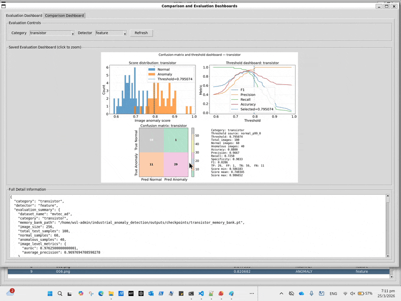

# UAD-DEMO
## Unsupervised Industrial Anomaly Detection using MVTec AD  
[!▶️[Watch the video]](https://youtu.be/qHqG2Wsurzc)

## Inspection of bottle 

## Inspection of transistor and evaluation dashboard  

## Evaluation dashboard  

### Refer to the following steps to run UAD-GUI App locally!  

### Dataset setup
MVTec AD dataset: https://www.mvtec.com/research-teaching/datasets/mvtec-ad

### Create this folder
<pre>
data/
  mvtec_ad/
</pre>

### Download the MVTec AD dataset, extract the zip file, and copy these folders into data/mvtec_ad
<pre>
data/
  mvtec_ad/
    bottle/
    screw/
    metal_nut/
    capsule/
    cable/
    transistor/
src/
</pre>

### Environment setup (Windows)
<pre>
python3 -m venv .venv
.\.venv\Scripts\Activate.ps1
pip install -r requirements.txt
</pre>

### Run from the project root:
<pre>
python -m src.ui.tkinter_app
</pre>

